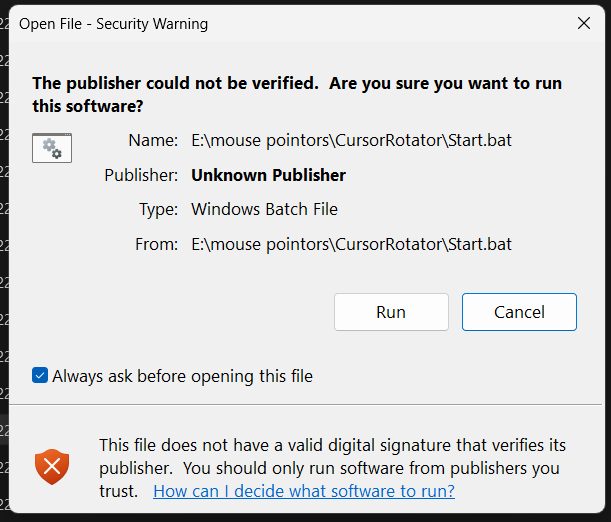

<p align="center">
  
</p>

<h1 align="center">Cursor Rotator</h1>

<p align="center">
  <b>Your Windows mouse cursor, on shuffle.</b><br>
  Drop cursor packs in a folder, pick an interval, and Windows gets a new cursor theme automatically —
  controlled from a small local web UI.
</p>

<p align="center">
  
  
  
  
  
  
</p>

---

## What it does

* **Rotates your cursor theme** on a timer — every 5 seconds to every 24 hours, your choice.
* **Reads any cursor pack**: `.zip`, `.7z`, `.rar`, or plain folders of `.cur` / `.ani` files.
  Square brackets, spaces and `#` in names are handled correctly.
* **Unpacks archives itself** — no WinRAR licence needed. Built-in unzip first, portable 7-Zip second,
  WinRAR only if you happen to have it. Each archive is unpacked exactly once.
* **Figures out which file is which cursor** — parses the pack's `install.inf` when present, otherwise
  matches file names against a large token dictionary (`Kuro precision.ani` → *Precision Select*).
* **Fills the gaps.** Most packs have no *Location* / *Person* / *Handwriting* cursor. Instead of leaving
  three Windows cursors in the middle of your theme, the app borrows the pack's own arrow. Effective
  coverage: **17/17 on every tested pack**.
* **Built-in store: 56 free packs** from public GitHub releases, with categories — RGB, Animated, Anime,
  Game, Minimal, Colorful, Dark, Light, macOS, Windows 11. Bundles like Capitaine (16 themes) and
  Dota 2 (24 themes) mean a handful of clicks gives you 40+ usable packs.
* **Animated previews that really animate.** `.ani` files are parsed frame by frame (RIFF/ACON) and
  played back in the browser at their real timing — you see the spinner spin before you apply it.
* **Add your own from the UI**: drag and drop a `.zip` / `.7z` / `.rar`, upload loose `.cur` / `.ani`
  files, or upload a whole already-unzipped folder. No file manager needed.
* **Build your own pack**: mix cursors from different themes — arrow from one, loading ring from
  another — name it, and it becomes a normal pack in the rotation.
* **Rename and delete packs** from the card menu, and one **Remove everything** button that restores
  Windows, clears settings, removes autorun and (optionally) deletes every pack.
* **Local web control panel** with real cursor previews (animated `.ani` files show their first frame),
  per-pack ON/OFF switches, manual role assignment, hotkeys, autorun and a one-click undo.
* **No installer, no telemetry, no admin rights.** One PowerShell file, a few `.bat` shortcuts, and the
  only network traffic is you pressing Download.

## Quick start

```text
1. Download the ZIP        Code -> Download ZIP   (or a release zip)
2. IMPORTANT, do it first  right-click the ZIP -> Properties -> tick "Unblock" -> OK
3. Extract it anywhere     e.g. E:\mouse pointers\CursorRotator
4. Double-click            Start.bat
5. No packs yet?           "Download Cursor Packs (menu).bat" -> pick a category
```

The control panel opens at <http://127.0.0.1:8777>. Everything can be undone with
**Restore Windows Default** (your original scheme is backed up on first launch).

### "The publisher could not be verified" — what to do



Windows tags every file that came out of a downloaded ZIP with a hidden *"downloaded from the
internet"* mark, and then warns about it. Nothing is wrong with the files — this happens to every
unsigned script on Windows. Three ways to get rid of it:

1. **Best:** unblock the **ZIP** *before* extracting — right-click the zip → **Properties** →
   tick **Unblock** → OK → extract.
2. Already extracted? Double-click **`Unblock Files (fix Windows warning).bat`** once
   (or run `.\CursorRotator.ps1 -Unblock`).
3. Just press **Run** in the dialog — the app also clears the mark from its own folder every time
   it starts, so the warning disappears from the second launch onwards.

The app is a plain PowerShell script: you can read every line before running it.

## The cursor store

| Category | What's inside |
|---|---|
| **RGB** | Bibata Rainbow Modern / Original — colour-cycling rainbow, every cursor animated |
| **Animated** | Rainbow ×2, all six anime packs, Pokemon, Marathon, Notwaita ×3 |
| **Anime** | Neuro-sama, Ellen Joe, Kuro, Noelle, Shiori Novella, Wanderer |
| **Game / Fun** | Pokemon (pokeball loading rings), Marathon Bold + Regular |
| **Minimal** | Bibata Modern / Original (Ice, Classic, Amber), GoogleDot ×4, macOS ×2, Notwaita |
| **Colorful** | Bibata Pink, Dodger Blue, Turquoise, Dark Red + two 4-colour bundles |
| **Windows 11** | Modern Cursors v2 Dark / Light, Windows 11 Dark / Light (animated) |
| **Bundles** | Capitaine Cursors (16 themes in one zip), Dota 2 (24 themes), Bibata Extra (4 colours) |
| **More game / anime** | Dota 2 heroes, Frieren, Nezuko, Furina, Camellya, Cyberpunk, Felyne, Cinnamon and more |

Download them from the **Download Store** tab (search + category chips + checkbox multi-select +
progress bar), from `Download Cursor Packs (menu).bat`, or from the command line:

```powershell
.\CursorRotator.ps1 -Download tags                  # list categories
.\CursorRotator.ps1 -Download list -Tag Animated    # browse one category
.\CursorRotator.ps1 -DownloadAll -Tag RGB           # download a category
.\Download-Cursors.ps1 -Id pokemon,marathon         # download specific packs
```

All packs are pulled straight from their authors' GitHub releases; nothing is re-hosted here.

## Using your own packs

Three ways, all equal:

* **Drag and drop** an archive or loose cursor files onto the **Add your own cursors** box in the app.
* **Upload an unzipped folder** with the same box (`Upload an unzipped folder`).
* **Copy files** into `Packs\` yourself and press **Rescan**.

Each archive is unpacked into a folder with the same name, **once** — a marker file remembers size and
timestamp, so restarting the app never re-extracts anything. Everything lives in **one folder**
(`Packs\`); there is no second cursor location to keep in sync.

Anything in `Packs\` that is not a cursor (readme files, screenshots, `uninstall.bat`, ...) is simply
listed under *Files ignored* in Diagnostics — it never causes an error.

## Make your own pack

**Create custom pack** in the left column opens the builder: pick a pack to start from, then swap any
individual cursor for one from any other pack, give it a name and save. The result is written to
`Packs\_My Custom Packs\<your name>\` with role-named files, so detection is perfect and it behaves
like any other pack.

## Removing it

* **Restore Windows Default** — original cursors back, app keeps running.
* **Danger zone → Remove everything** (or `Remove Everything (uninstall).bat`) — original cursors,
  autorun entry gone, settings deleted, and optionally every downloaded pack deleted. Then the folder
  can just be thrown away.

## Command line

| Command | Effect |
|---|---|
| `.\CursorRotator.ps1` | Start with tray icon and control panel |
| `.\CursorRotator.ps1 -Silent -NoBrowser` | Start hidden (what autorun uses) |
| `.\CursorRotator.ps1 -Random` | Change cursor once and exit |
| `.\CursorRotator.ps1 -Apply "Bibata-Modern-Ice"` | Apply a specific pack |
| `.\CursorRotator.ps1 -Every 300` | Set the interval to 5 minutes |
| `.\CursorRotator.ps1 -List` | List detected packs with coverage |
| `.\CursorRotator.ps1 -Restore` | Put the original Windows cursors back |
| `.\CursorRotator.ps1 -Setup7Zip` | Fetch portable 7-Zip for `.rar` / `.7z` |
| `.\CursorRotator.ps1 -RemoveAll` | Restore cursors, clear settings, remove autorun |
| `.\CursorRotator.ps1 -RemoveAll -DeletePacks` | The same, and delete every pack |

Full reference, including the local HTTP API: **[docs/COMMANDS.md](docs/COMMANDS.md)**.

## Documentation

* **[docs/USER-GUIDE.md](docs/USER-GUIDE.md)** — the complete 14-section manual
* **[docs/COMMANDS.md](docs/COMMANDS.md)** — CLI, `.bat` shortcuts and HTTP API
* **[READ ME FIRST.txt](READ%20ME%20FIRST.txt)** — one-page quick start for non-technical users
* **[CHANGELOG.md](CHANGELOG.md)** — what changed in each version
* **[PUBLISH.md](PUBLISH.md)** — how this repository is published and released

## How it works

```
Packs\*.zip ──► extractor (unzip / 7-Zip / WinRAR) ──► Packs\<name>\
                                                          │
                                          install.inf ─────┼──► role map (17 cursor jobs)
                                          file names ──────┘        │
                                                                    ▼
                        HKCU\Control Panel\Cursors  +  SystemParametersInfo(SPI_SETCURSORS)
```

A timer picks a random enabled pack, writes the 17 registry values and asks Windows to refresh —
no logout, no reboot. The web UI is a `HttpListener` bound to `127.0.0.1` only.

## Requirements

* Windows 10 or 11
* Windows PowerShell 5.1 (ships with Windows) or PowerShell 7+
* No admin rights, no .NET install, no external modules

## Install from source

```powershell
git clone https://github.com/j66320238-crypto/Coursor-Rotator.git
cd Coursor-Rotator
.\CursorRotator.ps1
```

## Contributing

Issues and pull requests are welcome — see [CONTRIBUTING.md](CONTRIBUTING.md).
Bug reports: <https://github.com/j66320238-crypto/Coursor-Rotator/issues>.
Adding a pack to the store is a three-line change in the `$Script:Store` table.

## License

[MIT](LICENSE) © 2026 [j66320238-crypto](https://github.com/j66320238-crypto) — do whatever you like
with it, just keep the copyright notice.

The cursor packs offered in the store are **not** part of this project and keep their own licences
(mostly GPL-3.0 / CC-BY-SA / MIT). They are downloaded directly from their authors' repositories at
runtime — see [THIRD-PARTY.md](THIRD-PARTY.md) for the full list and credits.
